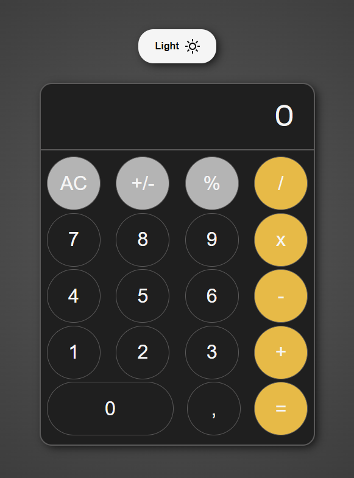

# Task: Simple Calculator



### [Link to the task](./docs/task.pdf)

### [Link to deployed app](https://antodi99.github.io/calculator-app/)

## Done:

### UI:

- [x] Responsive design for mobiles, tablets and desktops
- [x] Theme Management(switch for dark and light theme)
- [x] The input of numbers from the UI and keyboard has been developed

### Mathematical logic:

- [x] Mathematical functions are implemented: division, multiplication, subtraction, addition, percentage, sign change.
- [x] The accuracy for integers 10^13 and for decimals 10^5

### Code formation:

- [x] Prettier is configured and linked to ESLint
- [x] Implemented a pre-commit hook

## Technologies used:

1. JavaScript
1. HTML
1. SCSS
1. eslint, prettier
1. husky, lint-staged
1. webpack
1. npm

## How to run app:

### To run app use should run this commands:

```bash
# install all dependencies
npm install

# init husky
npm run prepare

# to build app
npm run build

# to run app on dev server(port: 4000)
npm run dev
```

## Folder structure:

```bash
./src
├── components # UI components(js files)
│   ├── button.js
│   └── main.js
├── index.html # root template
├── index.js # root js file
├── styles # app styles(scss files)
│   ├── index.scss
│   └── reset.scss
└── utils # utils for calculating logic(js files)
    ├── displayNumbers.js
    ├── eventsOnButtons.js
    ├── formatNumber.js
    ├── operationsWithDecimal.js
    ├── operationsWithIntegers.js
    └── removeDecimal.js
```
